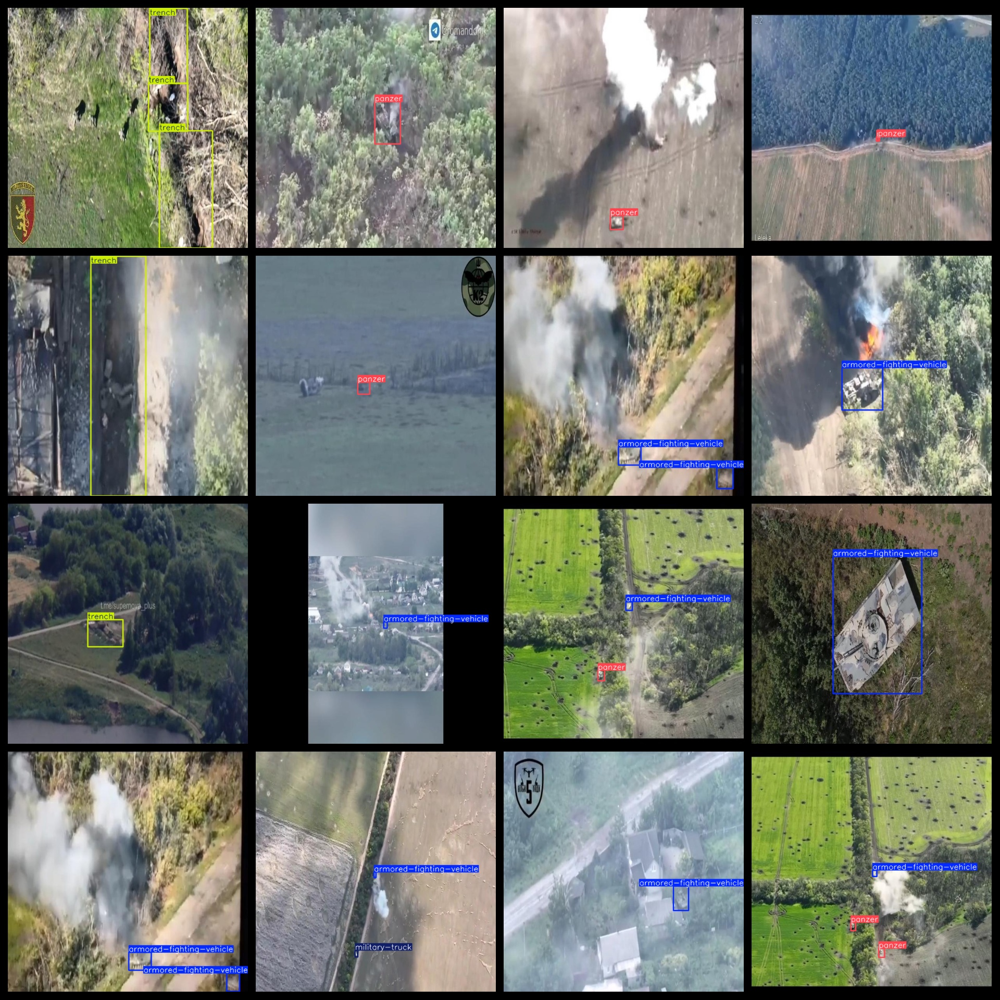
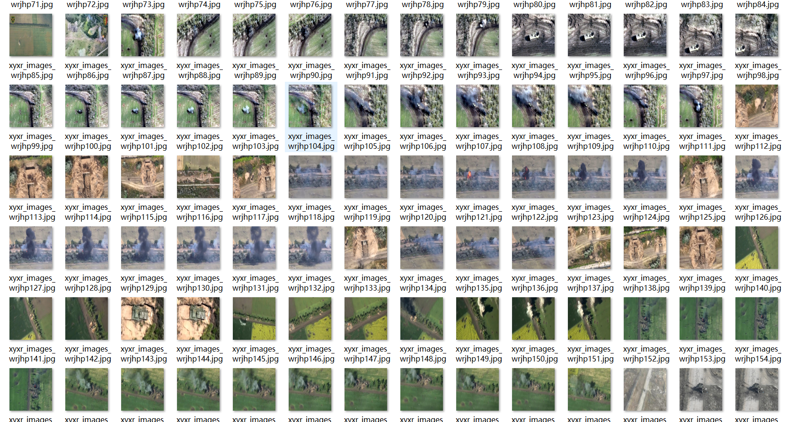

# UAV Aerial Military Target Detection Dataset 5239 imagesVOC+YOLO format

The dataset for UAV aerial photography of military targets is 5239 images in VOC+YOLO format.

Dataset Format: VOC format + YOLO format

The compressed file contains: three folders, each storing images, xml files, and text files.

Total jpg images in JPEGImages folder: 5239

The total number of xml files in the Annotations folder: 5239

The total number of txt files in the labels folder is 5239.

Number of tag types: 8

Tag names: ["armored-fighting-vehicle","artillery","heavy vehicle","light vehicle","military-truck","mlrs","panzer","trench"]

The number of boxes for each label (Note that the order of labels in the Yolo format does not correspond to this, but is based on the classes.txt file in the labels folder):

armored-fighting-vehicle frame count = 3296

artillery frame count = 10

heavy vehicle frame count = 473

light vehicle frame count = 12

military-truck frame count = 641

mlrs frame count = 179

panzer frame count = 4118

trench frame count = 1386

Total boxes: 10115

Picture clarity (Resolution: Pixels): Clear

Is the image enhanced: No

Shape of the label: Rectangular box, used for object detection and recognition.

Important Note: None

Special Notice: This dataset does not guarantee the accuracy or precision of the trained models or weight files. The dataset only provides accurate and reasonable annotations.

Annotation and image details are as follows:

## Images

---

Here is a pay link on Stripe (https://buy.stripe.com/3cs8yP7sY87d0vu9AB). Please contact me lonlonago@foxmail.com after funding $89, and I will send you a complete data files, thank you!

